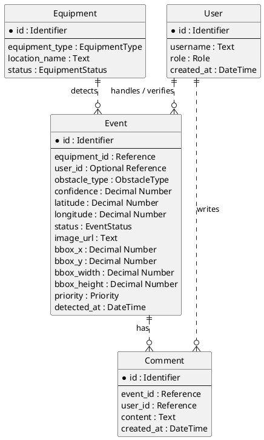

# Step 5. PlantUML 기반 도메인 모델 다이어그램 초안

## 1. 작성 기준

이 다이어그램은 논리 도메인 모델을 텍스트로 표현한 초안이다.

물리 DB DDL이 아니며, PostgreSQL 전용 타입이나 인덱스 설계는 포함하지 않는다.

## 2. PlantUML 초안

## 3. 관계 해석

| 관계 | 해석 |
| --- | --- |
| User -> Event | 한 명의 관제사는 0개 이상의 이벤트를 담당하거나 확인할 수 있다. 이벤트는 최초 등록 시 담당 관제사가 없을 수 있다. |
| Equipment -> Event | 하나의 장비는 0개 이상의 이벤트를 탐지할 수 있다. 이벤트는 반드시 탐지 장비를 가져야 한다. |
| User -> Comment | 한 명의 관제사는 0개 이상의 코멘트를 작성할 수 있다. |
| Event -> Comment | 하나의 이벤트는 0개 이상의 코멘트를 가질 수 있다. |

## 4. 제외된 모델

다음 도메인은 MVP 제외 범위에 따라 다이어그램에 포함하지 않는다.

| 제외 모델 | 이유 |
| --- | --- |
| Detection | 다중 객체 탐지는 이번 MVP 범위가 아니다. |
| EventStatusHistory | 별도 상태 변경 이력 테이블은 이번 MVP 범위가 아니다. |
| RolePermission | 복잡한 권한 관리는 이번 MVP 범위가 아니다. |
| EquipmentLocation | Equipment 자체 지도 좌표 관리는 이번 MVP 범위가 아니다. |

## 5. Step 5 결론

도메인 다이어그램은 `User`, `Equipment`, `Event`, `Comment` 네 엔티티로 충분하다.

MVP 핵심 흐름은 `Equipment -> Event`와 `User -> Event` 관계를 중심으로 동작하고, 처리 기록 기능을 포함하는 경우 `Comment`가 `User`와 `Event`를 연결한다.
