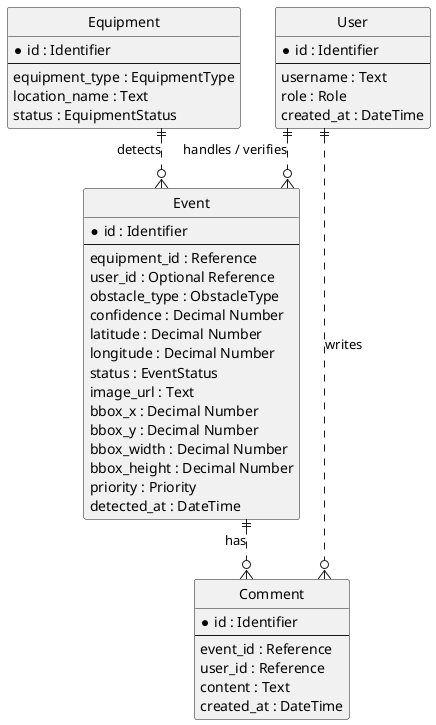

# Step 6. 최종 도메인 모델 명세서

## 1. 문서 목적

이 문서는 `domain-modeling` 단계의 최종 산출물이다.

확정된 요구사항과 MVP 범위를 바탕으로 AI 기반 실시간 도로 장애물 관제 시스템의 핵심 도메인 엔티티, 속성, 관계, 제약 조건을 논리적으로 정의한다.

## 2. 모델링 원칙

| 원칙 | 내용 |
| --- | --- |
| MVP 중심 | AI 탐지 이벤트가 관제사의 확인과 상태 처리로 이어지는 최소 흐름을 지원한다. |
| 비식별 관계 | 모든 관계는 비식별 관계로 유지한다. |
| 독립 식별자 | 모든 엔티티는 독립적인 고유 식별자를 가진다. |
| Zero or Many | 부모 엔티티는 0개 이상의 자식 엔티티를 가질 수 있다. |
| 제외 범위 준수 | Detection, EventStatusHistory, Equipment 자체 좌표, 복잡한 권한 모델은 포함하지 않는다. |

## 3. 최종 엔티티 목록

| 엔티티 | 정의 | MVP 역할 |
| --- | --- | --- |
| User | 도로 관제사 또는 시스템 사용자를 나타낸다. | 이벤트 담당자, 코멘트 작성자 식별에 사용한다. |
| Equipment | 도로 장애물을 탐지하는 CCTV 또는 드론 장비를 나타낸다. | 이벤트 발생 장비 식별에 사용한다. |
| Event | AI가 탐지한 도로 장애물 이벤트를 나타낸다. | MVP의 중심 엔티티다. |
| Comment | 관제사가 이벤트에 남기는 처리 기록 또는 확인 메모를 나타낸다. | 처리 기록 기능을 포함할 때 사용한다. |

## 4. 엔티티별 핵심 속성

### User

| 속성 | 필수 여부 | 설명 |
| --- | --- | --- |
| id | 필수 | User의 고유 식별자 |
| username | 필수 | 관제사 또는 사용자의 이름 |
| role | 필수 | 사용자 역할 |
| created_at | 필수 | 사용자 등록 시각 |

### Equipment

| 속성 | 필수 여부 | 설명 |
| --- | --- | --- |
| id | 필수 | Equipment의 고유 식별자 |
| equipment_type | 필수 | 장비 종류 |
| location_name | 필수 | 장비 설치 또는 운용 거점 이름 |
| status | 필수 | 장비 상태 |

### Event

| 속성 | 필수 여부 | 설명 |
| --- | --- | --- |
| id | 필수 | Event의 고유 식별자 |
| equipment_id | 필수 | 이벤트를 탐지한 Equipment 참조 |
| user_id | 선택 | 이벤트를 확인하거나 담당한 User 참조 |
| obstacle_type | 필수 | 장애물 종류 |
| confidence | 필수 | AI 탐지 신뢰도 |
| latitude | 필수 | 장애물 발생 위치의 위도 |
| longitude | 필수 | 장애물 발생 위치의 경도 |
| status | 필수 | 이벤트 처리 상태 |
| image_url | 필수 | 탐지 근거 이미지 또는 영상 참조 정보 |
| bbox_x | 필수 | 장애물 강조 박스 x 좌표 |
| bbox_y | 필수 | 장애물 강조 박스 y 좌표 |
| bbox_width | 필수 | 장애물 강조 박스 너비 |
| bbox_height | 필수 | 장애물 강조 박스 높이 |
| priority | 필수 | 이벤트 처리 우선순위 |
| detected_at | 필수 | 탐지 또는 등록 시각 |

### Comment

| 속성 | 필수 여부 | 설명 |
| --- | --- | --- |
| id | 필수 | Comment의 고유 식별자 |
| event_id | 필수 | 연결된 Event 참조 |
| user_id | 필수 | 작성한 User 참조 |
| content | 필수 | 처리 기록, 확인 메모, 오탐 사유 |
| created_at | 필수 | 코멘트 작성 시각 |

## 5. 최종 관계 모델

| 관계 | 카디널리티 | 선택성 | 관계 유형 |
| --- | --- | --- | --- |
| User -> Event | 1 : 0..N | Event의 User 참조는 선택 | 비식별 |
| Equipment -> Event | 1 : 0..N | Event의 Equipment 참조는 필수 | 비식별 |
| User -> Comment | 1 : 0..N | Comment의 User 참조는 필수 | 비식별 |
| Event -> Comment | 1 : 0..N | Comment의 Event 참조는 필수 | 비식별 |

## 6. 핵심 도메인 제약

| 항목 | 제약 |
| --- | --- |
| Event user_id | 최초 AI 탐지 시에는 비어 있을 수 있다. |
| Event equipment_id | 이벤트는 반드시 탐지 장비와 연결되어야 한다. |
| Event confidence | AI 신뢰도는 0.0 이상 1.0 이하 의미 범위를 가진다. |
| Event latitude/longitude | 지도 표시 가능한 유효 좌표 범위 안에 있어야 한다. |
| Event status | 허용된 이벤트 상태 안에서만 관리한다. |
| Event bbox | 프론트엔드가 강조 박스를 그릴 수 있는 유효한 좌표 정보여야 한다. |
| Event priority | 허용된 우선순위 체계 안에서 관리한다. |
| Comment | 반드시 Event와 User에 연결되어야 하며 내용이 비어 있으면 안 된다. |

## 7. 최종 PlantUML

## 8. 후속 단계 전달 사항

다음 항목은 `database-design`과 구현 지시서 단계에서 구체화해야 한다.

| 항목 | 후속 결정 필요 |
| --- | --- |
| bbox 좌표 기준 | 픽셀 기준 또는 정규화 기준 결정 필요 |
| bbox 기준점 | 좌상단 또는 중심점 기준 결정 필요 |
| priority 값 체계 | 숫자형 등급 또는 문자열 등급 결정 필요 |
| image_url 의미 | 이미지 파일 경로 또는 영상 참조 방식 결정 필요 |
| 정보 부족 이벤트 처리 | 등록 거부 또는 별도 상태 저장 결정 필요 |

## 9. 최종 결론

최종 도메인 모델은 `User`, `Equipment`, `Event`, `Comment` 네 엔티티로 구성한다.

MVP의 중심은 `Event`이며, `Equipment`는 탐지 출처, `User`는 관제 담당자, `Comment`는 조건부 처리 기록을 표현한다.

모든 관계는 비식별 관계와 `Zero or Many` 원칙을 유지하며, MVP 제외 범위인 `Detection`, `EventStatusHistory`, `Equipment` 자체 좌표, 복잡한 권한 모델은 포함하지 않는다.
