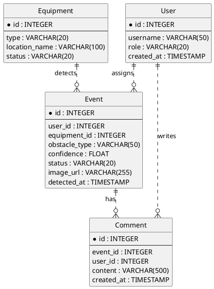

# ERD 0519 Extracted Notes

Source image: `erd0519.jpg`

This document is a manual extraction from the ERD image. Because the source image
has limited resolution, fields marked as "review needed" should be checked
against the original ERD tool or a higher-resolution export before being treated
as final design decisions.

## Overview

The ERD contains four domain tables:

- `User`
- `Equipment`
- `Event`
- `Comment`

The diagram uses independent integer primary keys for each table and non-identifying
relationships between entities.

## Tables

### User

| Column | Physical Name | Type | Nullability | Notes |
| --- | --- | --- | --- | --- |
| ID | `id` | `INTEGER` | `NOT NULL` | Primary key |
| Username | `username` | `VARCHAR(50)` | `NOT NULL` |  |
| Role | `role` | `VARCHAR(20)` | `NOT NULL` |  |
| Created_at | `created_at` | `TIMESTAMP` | `NOT NULL` |  |

### Equipment

| Column | Physical Name | Type | Nullability | Notes |
| --- | --- | --- | --- | --- |
| ID | `id` | `INTEGER` | `NOT NULL` | Primary key |
| Type | `type` | `VARCHAR(20)` | `NOT NULL` | Example values may be `CCTV`, `DRONE` |
| Location_name | `location_name` | `VARCHAR(100)` | `NOT NULL` |  |
| Status | `status` | `VARCHAR(20)` | `NOT NULL` |  |

### Event

| Column | Physical Name | Type | Nullability | Notes |
| --- | --- | --- | --- | --- |
| ID | `id` | `INTEGER` | `NOT NULL` | Primary key |
| User_id | `user_id` | `INTEGER` | `NULL` | Foreign key to `User.id`; earlier decision docs say this should allow `NULL` for initially unassigned events |
| Equipment_id | `equipment_id` | `INTEGER` | `NOT NULL` | Foreign key to `Equipment.id` |
| Obstacle_type | `obstacle_type` | `VARCHAR(50)` | `NOT NULL` |  |
| Confidence | `confidence` | `FLOAT` | `NOT NULL` |  |
| Status | `status` | `VARCHAR(20)` | `NOT NULL` |  |
| Image_URL | `image_url` | `VARCHAR(255)` | `NOT NULL` |  |
| Detected_at | `detected_at` | `TIMESTAMP` | `NOT NULL` |  |
| Latitude | `latitude` | `FLOAT` | `NOT NULL` |  |
| Longitude | `longitude` | `FLOAT` | `NOT NULL` |  |
| Bbox_x | `bbox_x` | `FLOAT` | `NOT NULL` |  |
| Bbox_y | `detected_at` | `FLOAT` | `NOT NULL` |  |
| Bbox_width | `detected_at` | `FLOAT` | `NOT NULL` |  |
| Bbox_height | `detected_at` | `FLOAT` | `NOT NULL` |  |
| Priority | `priority` | `INTEGER` | `NOT NULL` |  |

### Comment

| Column | Physical Name | Type | Nullability | Notes |
| --- | --- | --- | --- | --- |
| ID | `id` | `INTEGER` | `NOT NULL` | Primary key |
| Event_id | `event_id` | `INTEGER` | `NOT NULL` | Foreign key to `Event.id` |
| User_id | `user_id` | `INTEGER` | `NOT NULL` | Foreign key to `User.id` |
| Content | `content` | `VARCHAR(500)` | `NOT NULL` |  |
| Created_at | `created_at` | `TIMESTAMP` | `NOT NULL` |  |

## Relationships

| Parent | Child | Relationship | Notes |
| --- | --- | --- | --- |
| `User` | `Event` | `User.id` -> `Event.user_id` | One user can be associated with zero or many events. Event user assignment may be nullable based on decision docs. |
| `Equipment` | `Event` | `Equipment.id` -> `Event.equipment_id` | One equipment item can detect zero or many events. |
| `User` | `Comment` | `User.id` -> `Comment.user_id` | One user can write zero or many comments. |
| `Event` | `Comment` | `Event.id` -> `Comment.event_id` | One event can have zero or many comments. |

## PlantUML Draft

## Current Code Gaps Observed

The current implementation only contains the `Event` model and schema. It does
not yet implement the `User`, `Equipment`, and `Comment` tables from this ERD.

The current `Event` model differs from this ERD in several ways:

- It has `equipment_type` as a direct event field.
- It has `equipment_id` as a string field, while the ERD shows it as `INTEGER`.
- It does not have `user_id`, while the ERD and schema reference it.
- It has latitude/longitude fields in code, while this ERD image does not show
  latitude/longitude. Existing decision docs separately state that
  `Event.latitude` and `Event.longitude` are required `FLOAT` values.
